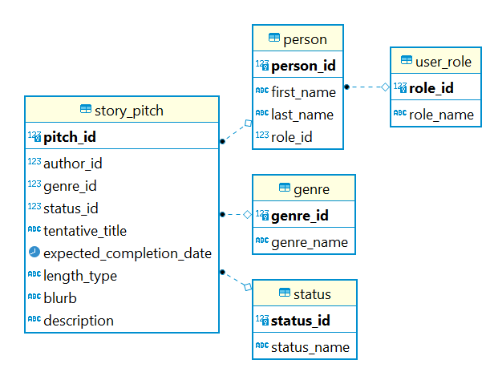

# Story Pitch Management System

Story Pitch Management System is an application which allows authors to submit pitches for stories to the publishing company. They can write a small description of the story they hope to write, and editors can go into the application and approve or reject story pitches based on whether they sound interesting or even suggest changes before approval.

## User Stories

1. Users can log in.
2. Authors can submit story pitches.
3. Authors can view their previously submitted pitches and the statuses of each.
4. Authors can modify pending story pitches.
5. Editors can view submitted story pitches in their genre(s) of expertise.
6. Editors can accept or reject pitches.
7. The senior editors can view editor-approved pitches.
8. The senior editors can make the final approval/rejection on pitches.

## ERD

Keep in mind that you can add or modify this as you see fit; it is meant as a guide to help you in the right direction.

## Other Information

Again, keep in mind that you can modify these to fit with your application's setup if needed.

### Pitch Information
- Author Name
- Tentative Title
- Expected completion date
- Genre
- Length (short story, novel, etc.)
- One-sentence blurb
- Description/summary
- *Optional:* Tentative cover photo

### Statuses
1. Pending Editor Approval
2. Editor-Approved
3. Pending Senior Editor Approval
4. Approved
5. Rejected

### User Roles
1. Author
2. Editor
3. Senior Editor

## Bonus User Stories

1. Editors can leave suggestion comments on pending story pitches.
2. Authors can view the comments left on their pitches.
3. Authors can edit and resubmit rejected pitches.