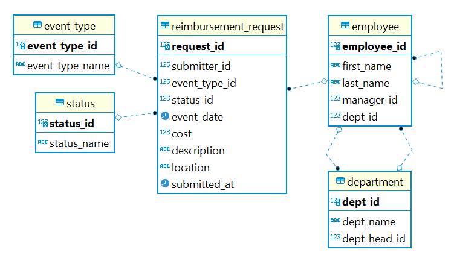

# Tuition Reimbursement Management System

Tuition Reimbursement Management System is an application which allows employees at a company to submit requests for reimbursement. If the employee decides to take a certification exam or attend a class, the company may reimburse them for the cost after they submit a request. Managers can then go into the application and approve or reject requests.

## User Stories

1. Employees can log in.
2. Employees can submit reimbursement requests.
3. Employees can view their previously submitted requests and the statuses of each.
4. Employees can add a final grade to manager-approved requests.
5. Managers can view the submitted requests from the employees who they manage.
6. Managers can accept or reject requests.
7. The department head can view manager-approved requests from employees in their department.
8. The department head can make the final approval/rejection on requests.

## ERD

Keep in mind that you can add or modify this as you see fit; it is meant as a guide to help you in the right direction.

## Other Information

Again, keep in mind that you can modify these to fit with your application's setup if needed.

### Request Information
- Employee Name
- Event Type (certification, class, seminar, etc.)
- Event Date
- Cost
- Description
- Location

### Statuses
1. Pending Manager Approval
2. Manager-Approved
3. Pending Dept Head Approval
4. Approved
5. Rejected

### Event Types
1. Certification
2. Class
3. Seminar/Conference
4. Other

## Bonus User Stories

1. Approvers and employees can leave comments on pending reimbursement requests.
2. Employees can view the comments left on their requests.
3. The system will flag requests that were submitted more than 24 hours ago as "Urgent".